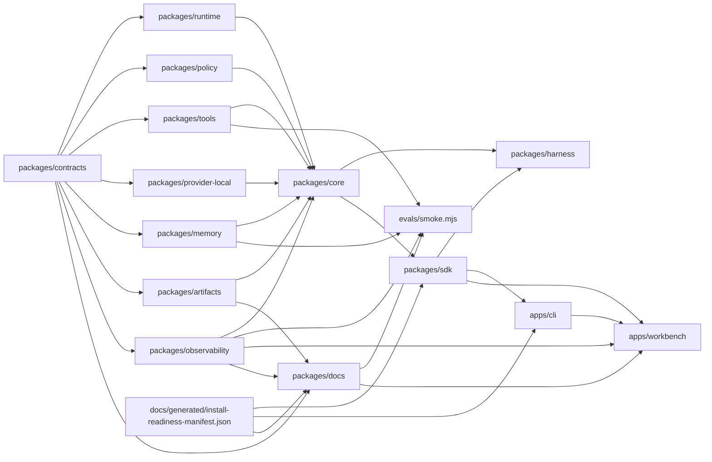

# Jami Harness System Map

## Provenance

- Source repo: `jami-harness`
- Source commit: `git:HEAD`
- Source ref: `main`
- Source input hash: `sha256:a2a8514df1afbb53fc09ab848af199ed3f6e84fd5ad103a605a7589c282f1afd`
- Command: `pnpm docs:generate -- --check`
- Command result: `passed`
- Freshness class: `deterministic_current_source_tree`

## Package Graph

## Source Counts

- Contract schemas: 20
- Contract fixtures: 73
- Package manifests: 17
- Changelog fragments: 52
