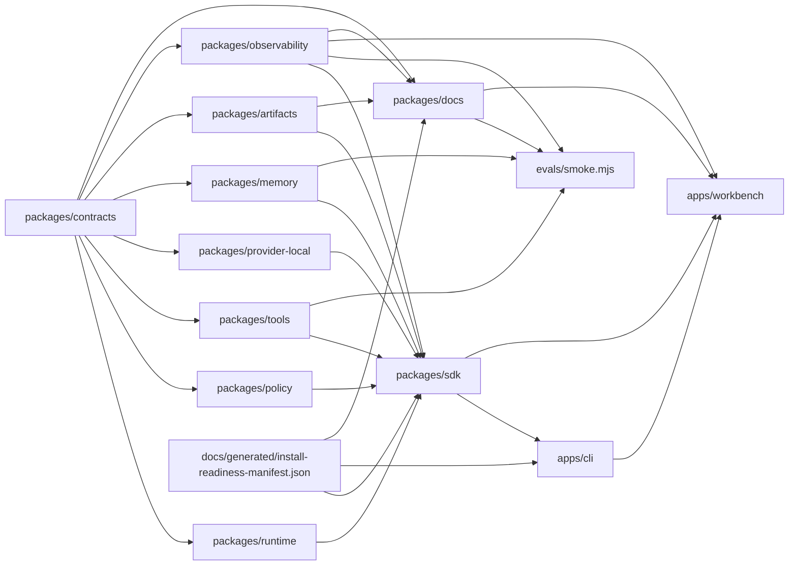

# Jami Harness System Map

## Provenance

- Source repo: `jami-harness`
- Source commit: `git:HEAD`
- Source ref: `main`
- Source input hash: `sha256:4693004a8d665da7bdc6d9306728754c2d2924f818cee6e001bcc07da4a9d85f`
- Command: `pnpm docs:generate -- --check`
- Command result: `passed`
- Freshness class: `deterministic_current_source_tree`

## Package Graph

## Source Counts

- Contract schemas: 20
- Contract fixtures: 37
- Package manifests: 14
- Changelog fragments: 37
