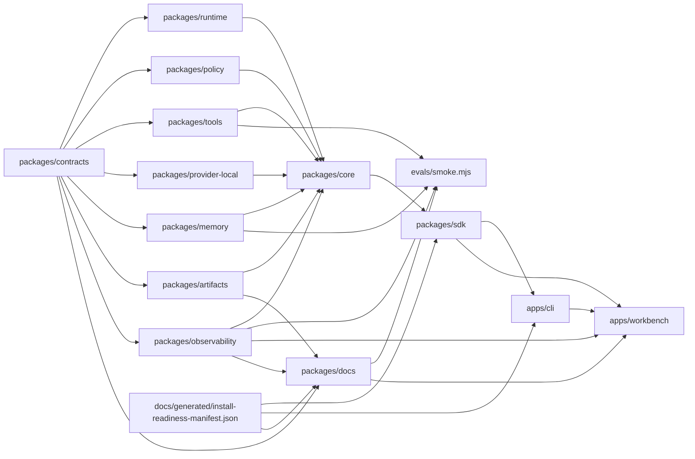

# Jami Harness System Map

## Provenance

- Source repo: `jami-harness`
- Source commit: `git:HEAD`
- Source ref: `main`
- Source input hash: `sha256:60c9e36c7b99719fce7ae4b0bab6d30ca26ba1e95586bd6bef7f4a90b2ed192f`
- Command: `pnpm docs:generate -- --check`
- Command result: `passed`
- Freshness class: `deterministic_current_source_tree`

## Package Graph

## Source Counts

- Contract schemas: 20
- Contract fixtures: 73
- Package manifests: 15
- Changelog fragments: 42
