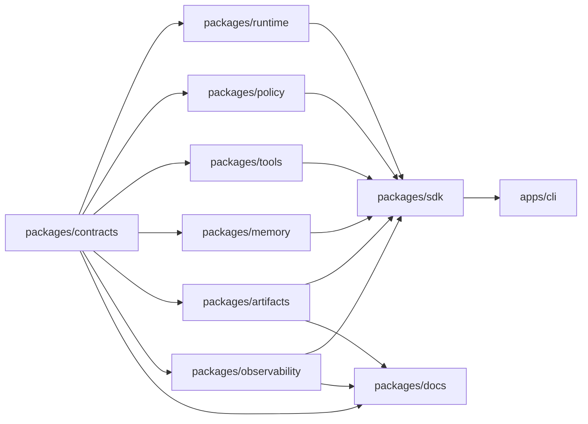

# Jami Harness System Map

## Provenance

- Source repo: `jami-harness`
- Source commit: `git:HEAD`
- Source ref: `main`
- Source input hash: `sha256:a6fb700c75f28437d773b42ab05882ea65d4dfa8e7afb0f6da4a8f163de36d24`
- Command: `pnpm docs:generate -- --check`
- Command result: `passed`
- Freshness class: `deterministic_current_source_tree`

## Package Graph

## Source Counts

- Contract schemas: 19
- Contract fixtures: 36
- Package manifests: 12
- Changelog fragments: 24
