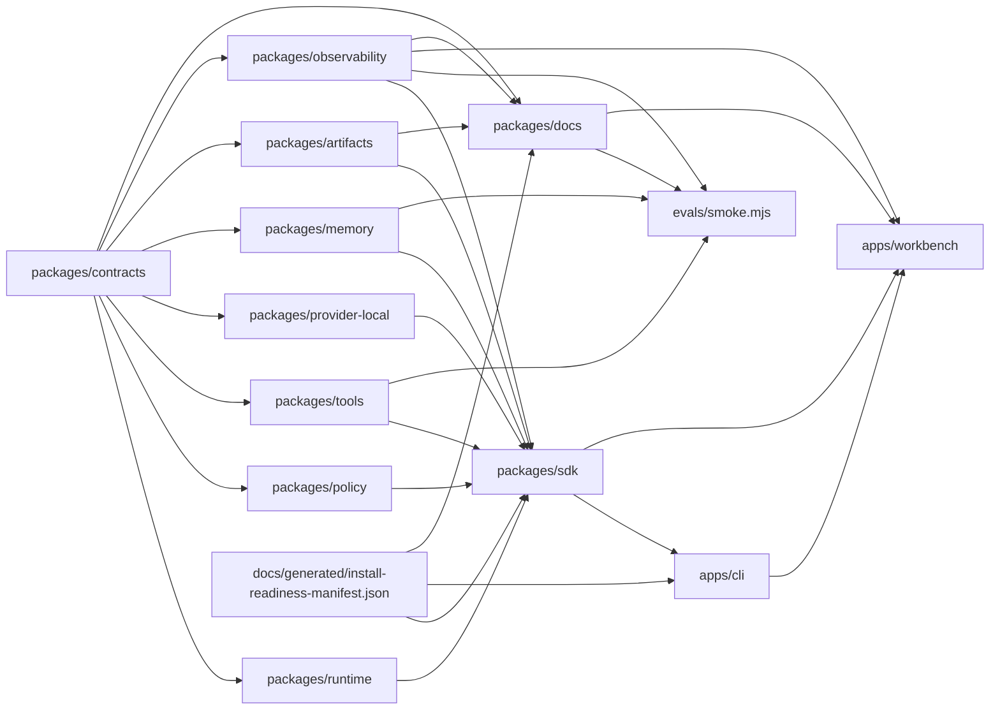

# Jami Harness System Map

## Provenance

- Source repo: `jami-harness`
- Source commit: `git:HEAD`
- Source ref: `main`
- Source input hash: `sha256:f361ee9cc4fb060b197bf99aeb7d827ac581adc1f40889a3a28187f6ee4e2054`
- Command: `pnpm docs:generate -- --check`
- Command result: `passed`
- Freshness class: `deterministic_current_source_tree`

## Package Graph

## Source Counts

- Contract schemas: 20
- Contract fixtures: 73
- Package manifests: 14
- Changelog fragments: 40
