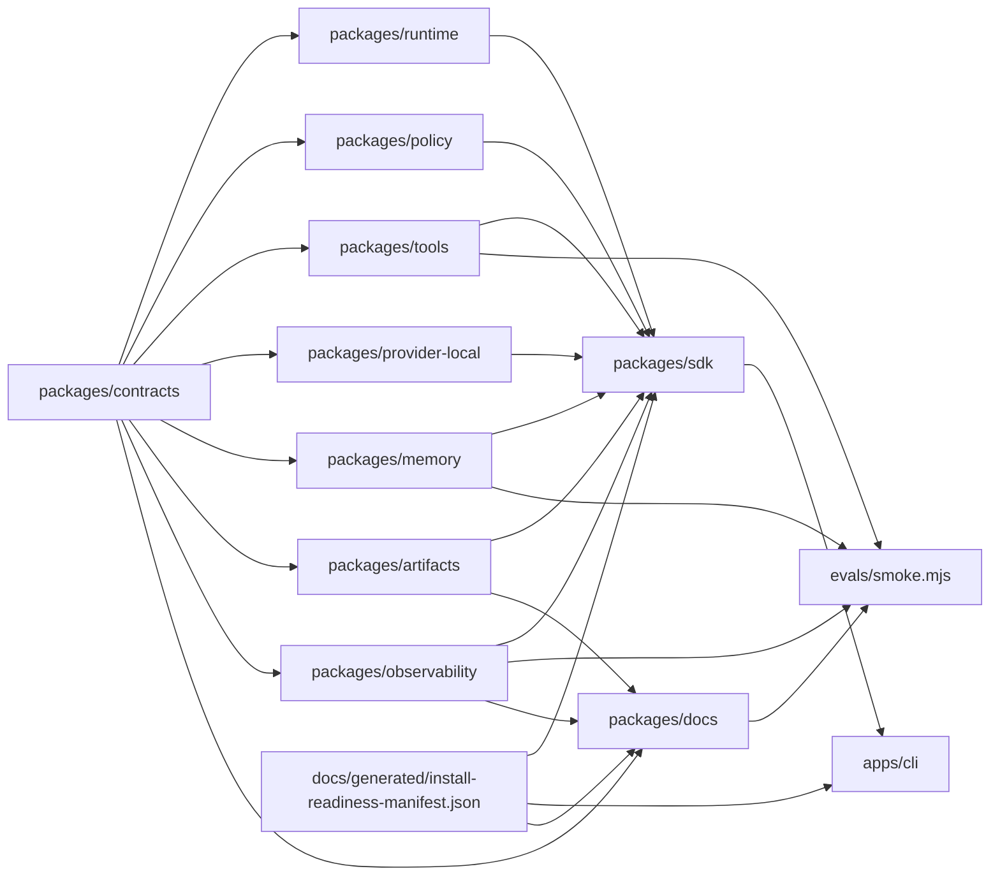

# Generated System Map

<!-- generated by packages/docs/scripts/generate-docs.mjs; do not edit by hand -->

## Provenance

- Source repo: `jami-harness`
- Source commit: `git:HEAD`
- Source ref: `main`
- Source input hash: `sha256:cb7abdceedb2edcc6dbef915a1bc1601f4830465f01b1866d96c80f7194ed06e`
- Command: `pnpm docs:generate -- --check`
- Command result: `passed`
- Freshness class: `deterministic_current_source_tree`

## Package Graph

## Source Counts

- Contract schemas: 20
- Contract fixtures: 37
- Package manifests: 13
- Changelog fragments: 34
