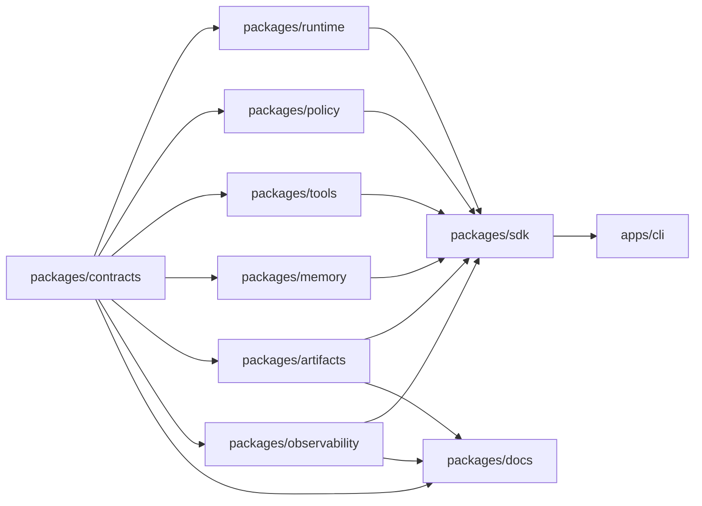

# Generated System Map

<!-- generated by packages/docs/scripts/generate-docs.mjs; do not edit by hand -->

## Provenance

- Source repo: `jami-harness`
- Source commit: `git:HEAD`
- Source ref: `main`
- Source input hash: `sha256:296f9bbc253bf92731b6a9cb053ff13edb6fc930516da8904cdf3b1611f72474`
- Command: `pnpm docs:generate -- --check`
- Command result: `passed`
- Freshness class: `deterministic_current_source_tree`

## Package Graph

## Source Counts

- Contract schemas: 19
- Contract fixtures: 36
- Package manifests: 11
- Changelog fragments: 23
